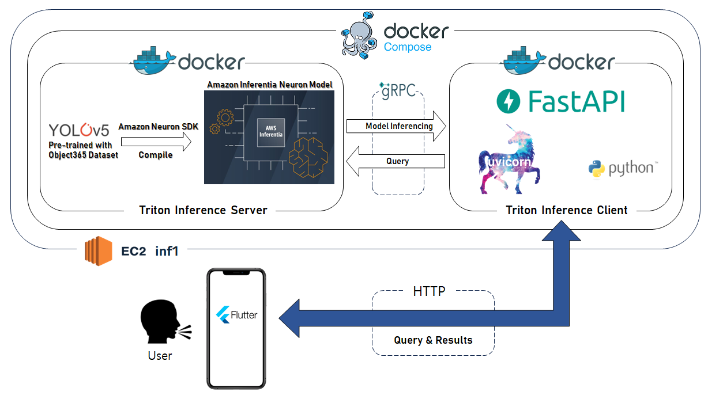

# YOTO - 전맹 시각장애인 물체 안내 어플리케이션
YOTO(You Only Talk Once) 
음성 입출력을 통해 전맹 시각장애인이 원하는 물체까지 도달하는 것을 돕는 어플리케이션

### 📋 프로젝트 소개
- 2023년 2학기 SKT 기업사회맞춤형캡스톤디자인 'YOTO'팀 결과물

### ⌛ 개발 기간
- 23.09.13 ~ 23.12.14
- 특허 출원 진행중

### 🧑‍🤝‍🧑 멤버구성
- 팀장: 강성민 (정보통신공학과)
- 팀원1: 강상훈 (정보통신공학과)
- 팀원2: 이대엽 (컴퓨터공학전공)
- 팀원3: 이지연 (컴퓨터공학전공)
- 팀원4: 황덕기 (기계로봇에너지공학과)

### 🔧 개발 환경
- **IDE**:  
- **Framework**: 
- **Language**:  

### 🗺 서버 구조
###

  

### 🎞 발표자료
- 최종발표자료 [[Link]](https://github.com/ReturnRudi/YOTO/blob/master/Deck/ppt.md)

